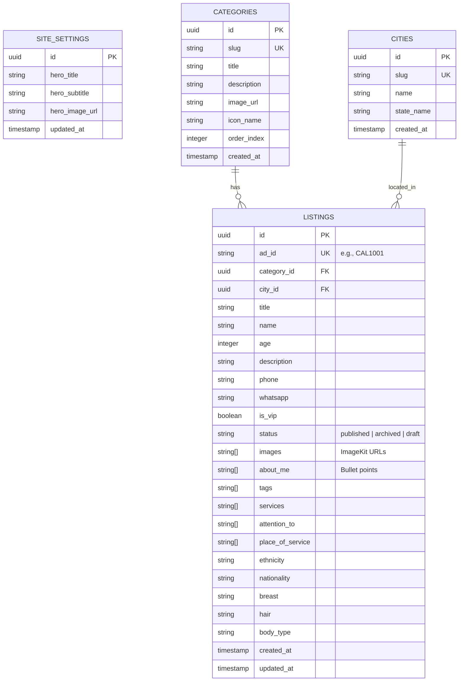

# Admin Panel & Backend Integration Plan

This document outlines the technical design, database schema, storage workflow, and implementation plan for integrating Supabase (Database & Auth) and ImageKit (Storage) with the Oklute escort platform.

---

## 1. Technical Architecture & Stack

- **Framework**: Next.js 16.2.6 (App Router)
- **Database**: Supabase PostgreSQL
- **Authentication**: Supabase Auth (restricted to Admin email/password login for now)
- **Storage**: ImageKit (direct client-side uploads with signed secure backend tokens)
- **UI Components**: shadcn/ui components (`table`, `chart`, `card`, `sidebar`, `dialog`, `form`, etc.)
- **Styling**: Tailwind CSS v4

---

## 2. Database Schema (Supabase)

We will define the following PostgreSQL tables in Supabase. All tables will reside in the `public` schema.



### SQL Table Schema Definitions

```sql
-- 1. Site Settings (for Hero CMS)
CREATE TABLE public.site_settings (
    id UUID PRIMARY KEY DEFAULT gen_random_uuid(),
    hero_title TEXT NOT NULL DEFAULT 'Flying Solo? No Worries, Oklute is made for all.',
    hero_subtitle TEXT NOT NULL DEFAULT 'Search or Post Your Adult Advertisement',
    hero_image_url TEXT NOT NULL DEFAULT '/hero-anime.png',
    updated_at TIMESTAMP WITH TIME ZONE DEFAULT timezone('utc'::text, now()) NOT NULL
);

-- 2. Categories
CREATE TABLE public.categories (
    id UUID PRIMARY KEY DEFAULT gen_random_uuid(),
    slug TEXT UNIQUE NOT NULL,
    title TEXT NOT NULL,
    description TEXT,
    image_url TEXT,
    icon_name TEXT, -- Lucide icon name mapping
    order_index INT DEFAULT 0,
    created_at TIMESTAMP WITH TIME ZONE DEFAULT timezone('utc'::text, now()) NOT NULL
);

-- 3. Cities (Locations)
CREATE TABLE public.cities (
    id UUID PRIMARY KEY DEFAULT gen_random_uuid(),
    slug TEXT UNIQUE NOT NULL,
    name TEXT NOT NULL,
    state_name TEXT NOT NULL,
    created_at TIMESTAMP WITH TIME ZONE DEFAULT timezone('utc'::text, now()) NOT NULL
);

-- 4. Listings
CREATE TABLE public.listings (
    id UUID PRIMARY KEY DEFAULT gen_random_uuid(),
    ad_id TEXT UNIQUE NOT NULL, -- Short code e.g. CAL1000
    category_id UUID REFERENCES public.categories(id) ON DELETE CASCADE NOT NULL,
    city_id UUID REFERENCES public.cities(id) ON DELETE CASCADE NOT NULL,
    title TEXT NOT NULL,
    name TEXT,
    age INT,
    description TEXT,
    phone TEXT,
    whatsapp TEXT,
    is_vip BOOLEAN DEFAULT false NOT NULL,
    status TEXT NOT NULL DEFAULT 'draft' CHECK (status IN ('published', 'archived', 'draft')),
    images TEXT[] DEFAULT '{}'::TEXT[] NOT NULL,
    about_me TEXT[] DEFAULT '{}'::TEXT[] NOT NULL,
    tags TEXT[] DEFAULT '{}'::TEXT[] NOT NULL,
    services TEXT[] DEFAULT '{}'::TEXT[] NOT NULL,
    attention_to TEXT[] DEFAULT '{}'::TEXT[] NOT NULL,
    place_of_service TEXT[] DEFAULT '{}'::TEXT[] NOT NULL,
    ethnicity TEXT,
    nationality TEXT,
    breast TEXT,
    hair TEXT,
    body_type TEXT,
    created_at TIMESTAMP WITH TIME ZONE DEFAULT timezone('utc'::text, now()) NOT NULL,
    updated_at TIMESTAMP WITH TIME ZONE DEFAULT timezone('utc'::text, now()) NOT NULL
);
```

---

## 3. Storage Architecture (ImageKit)

To support uploading 5 to 7 high-quality images per profile page (either one-by-one or in bundles):
1. **Authentication Endpoint**: We will implement `/api/imagekit/auth/route.ts` which generates secure signatures using the ImageKit private key.
2. **Client-side Uploader**: Client-side forms will call ImageKit API directly to upload files. This avoids Next.js server overhead and timeout limits.
3. **Database Storage**: The returned URL strings from ImageKit will be saved in the `images` text array inside the `listings` table.

---

## 4. Admin CMS Layout & Features

### A. Dashboard Overview (`/admin`)
- **Metric Cards**: Total Ads, Active (Published) Ads, Archived Ads, VIP Ads, and a mock page views metric.
- **Charts**: 
  - *Listings by Category* (Bar/Pie Chart)
  - *Creation Timeline* (Area/Line Chart tracking ad approvals over time)
- **Navigation**: Sidebar with routes:
  - Dashboard Overview (`/admin`)
  - Hero CMS (`/admin/homepage`)
  - Categories CMS (`/admin/categories`)
  - Locations CMS (`/admin/locations`)
  - Listings Table (`/admin/listings`)
  - Create/Edit Listing (`/admin/listings/new` or `/admin/listings/[id]`)

### B. Hero CMS (`/admin/homepage`)
- Edit hero background image (Upload via ImageKit).
- Edit main heading text ("Flying Solo? No Worries...").
- Edit subheadline/description band text.
- Revalidate homepage cache tags upon saving.

### C. Category CMS (`/admin/categories`)
- Form to add a new category: Title, Slug, Description, Order Index, Lucide Icon selection.
- Image uploader (via ImageKit) for the category background.
- Selectable city lists for homepage pill mappings.

### D. Location CMS (`/admin/locations`)
- Interface to add dynamic Indian States/Union Territories and Cities (with slug auto-generation).
- Newly added locations are immediately available in:
  1. The Ad Listing Editor city selectors.
  2. The frontend Search Popups and Location Categories lists.
  3. Dynamic routing parameters: requests to `/[categorySlug]/[newCitySlug]` automatically query listings filtering by the newly added city.

### E. Ad Listing Editor (`/admin/listings/[id]`)
- **Validation Constraints**: 
  - **Required**: Title, Category, City, and Images (at least 1 image up to 7 max).
  - **Optional**: Name, Age, Description, Phone, WhatsApp, VIP status, about_me bullet fields, Services, Place of Service, Attention To, and demographics (Ethnicity, Nationality, Breast, Hair, Body Type).
- **Interactive UI**:
  - Image Bundle Uploader: File drop-zone supporting multi-file selection or single files up to 7. Displays drag-and-drop ordering, deletion buttons, and loading states.
  - "About Me" bullets: A dynamic listing where the admin can add/remove lines of bullet text.
  - Multi-select badges for Services, Attention To, and Place of Service.

### F. Listings Table (`/admin/listings`)
- Table with 15 records per page, clean server-side pagination.
- Table Columns:
  - Image (thumbnail)
  - Title/Name
  - Category
  - Location (City, State)
  - VIP status (Badge)
  - Created Date
  - Status (badge for Published, Draft, Archived)
  - **Actions Column**:
    - **Publish/Unpublish toggle** (one-click status toggle)
    - **Archive action**
    - **Edit action** (redirects to editor)
    - **Delete action** (opens a confirmation modal)

---

## 5. Security & Authentication

- **Route Protection**: Use a Next.js 16 authentication check (`src/proxy.ts` and route layouts) to redirect unauthenticated requests away from `/admin/*` to `/admin/login`.
- **Supabase Session Management**: Cookie-based authentication using `@supabase/ssr` (server-side token validation).
- **Secret Separation**: Sensitive credentials (ImageKit private key, Supabase service roles) are stored strictly in server-side files and never prefixed with `NEXT_PUBLIC_`.

---

## 6. Storefront Integration & Route Handler Logic

- **Dynamic Router (`/[categorySlug]/[citySlug]`)**:
  - The dynamic segment `citySlug` will look up the `cities` table.
  - If the slug matches a city in the DB, it queries listings filtered by `category_id` and `city_id`.
  - If the slug does not match any city, it treats the segment as an `ad_slug` (e.g. `title-id` format), extracting the `id` from the suffix to fetch the detailed ad page from the `listings` table.
- **Cache Invalidation**:
  - The storefront catalog routes will use `"use cache"` component tags (e.g. `cacheTag("listings")`, `cacheTag("categories")`).
  - When an admin saves edits in the CMS (Hero, Listing, Location), the server action will call `revalidateTag(...)` or `updateTag(...)` to purge cached views instantly.

---

## 7. Immediate Open Clarifications for User

Before writing database migrations and Next.js server actions, please confirm the following:

1. **Pre-population of Cities**: We can pre-seed Supabase with a standard list of 50-60 Indian cities across states (like Mumbai, Delhi, Bangalore, Hyderabad, Kolkata, Chennai, Pune, Ahmedabad, Jaipur, etc.). Is there a specific list you want, or should we prepare a robust default set?
2. **Default Image Upload Limit**: Is a maximum limit of 7 images per listing sufficient?
3. **Admin User Creation**: Do you want to configure the admin account via direct Supabase Auth dashboard creation (which we will guide you on), or do you want us to write a script to register the initial admin?

---

Please review this plan. Let us know if you have any questions, edits, or if we should proceed to build the `adminplan.md` tasks in detail.
